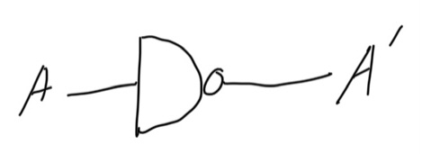

# 컴퓨터 구조
## 수업 정보
* 교수님: 오상엽 교수님.
* 교재: Practical Computer Architecture 오상엽 저.
* 학기: 1학년 2학기, 2020년도 2학기 수강.
## 논리회로(Logic Circuit)
* 2진수를 전기적으로 표현하고 처리하는 회로.
* 주로 반도체 사용.
    * 그 중에서 트랜지스터를 주로 사용.

### Transister
* transfer of signal through a varister
    * varister: variable register
* 신호 전송(전압과 전류의 흐름 조절)
    * 증폭
* Emitter Base Collector로 구성.
    * Emitter: 순방향 전류를 받음.
    * Base: 조절.
    * Collector: 역방향 전류를 받음.
* 이상 전압 방지.
    * 이상 전압: surge.

#### 논리 회로 구현에 사용하는 방법
1. TTL(Transister Transister Logic)
    * NAND 사용.
    * 가장 많이 사용됨.
1. ECL(Emitter Coupled Logic)
    * NOR 사용.
    * 게이트 지연시간이 적은 고속 회로에 사용.
1. MOS(Metal Oxide Semiconductor)
    * 산화막 형성 절연체에 금속을 입힘.
    * 집적도가 좋고 전력소비가 적음. 제조가 쉬움.
1. CMOS(Complementary MOS)
    * 인버터 회로에 P채널과 N채널 트랜지스터를 집적하여 구성.
    * 속도가 느리고 소비전력이 적음.

#### 논리회로 매개 평가 변수
1. fan out: 표준 게이트 출력에 가하는 표준 부하의 수.
1. power disipation(소비 전력): 게이트에서 소비되는 전력.
1. propagation delay(전파 지연): 게이트에서 사용하는 시간.
1. Noise margin: 노이즈 허용 마진.

#### 논리 게이트
* AND
    * 
    * 위키미디어, 퍼블릭 도메인.
* OR
    * 
    * 위키미디어, 퍼블릭 도메인.
* XOR
    * 
    * 위키미디어, 퍼블릭 도메인.
* NOT
    * 
    * 위키미디어, 퍼블릭 도메인.
* NAND를 이용한 NOT
    * 
    * 직접 그림.

