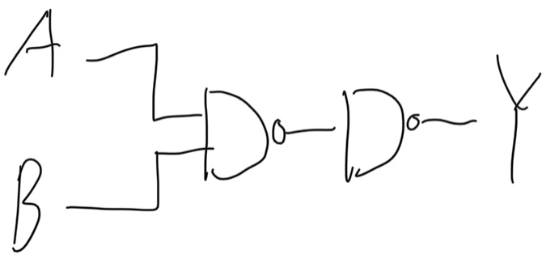
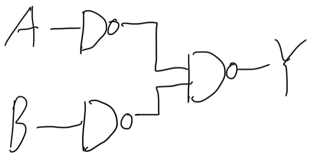

# 컴퓨터 구조

## 수업 정보

* 교수님: 오상엽 교수님.
* 교재: Practical Computer Architecture 오상엽 저.
* 학기: 1학년 2학기, 2020년도 2학기 수강.

## 논리회로(Logic Circuit)

* 2진수를 전기적으로 표현하고 처리하는 회로.
* 주로 반도체 사용.
    * 그 중에서 트랜지스터를 주로 사용.

### Transister

* transfer of signal through a varister
    * varister: variable register
* 신호 전송(전압과 전류의 흐름 조절)
    * 증폭
* Emitter Base Collector로 구성.
    * Emitter: 순방향 전류를 받음.
    * Base: 조절.
    * Collector: 역방향 전류를 받음.
* 이상 전압 방지.
    * 이상 전압: surge.

#### 논리 회로 구현에 사용하는 방법

1. TTL(Transister Transister Logic)
    * NAND 사용.
    * 가장 많이 사용됨.
1. ECL(Emitter Coupled Logic)
    * NOR 사용.
    * 게이트 지연시간이 적은 고속 회로에 사용.
1. MOS(Metal Oxide Semiconductor)
    * 산화막 형성 절연체에 금속을 입힘.
    * 집적도가 좋고 전력소비가 적음. 제조가 쉬움.
1. CMOS(Complementary MOS)
    * 인버터 회로에 P채널과 N채널 트랜지스터를 집적하여 구성.
    * 속도가 느리고 소비전력이 적음.

#### 논리회로 매개 평가 변수

1. fan out: 표준 게이트 출력에 가하는 표준 부하의 수.
1. power disipation(소비 전력): 게이트에서 소비되는 전력.
1. propagation delay(전파 지연): 게이트에서 사용하는 시간.
1. Noise margin: 노이즈 허용 마진.

#### 논리 게이트

* AND
    * 
    * 위키미디어, 퍼블릭 도메인.
* OR
    * 
    * 위키미디어, 퍼블릭 도메인.
* XOR
    * 
    * 위키미디어, 퍼블릭 도메인.
* NOT
    * 
    * 위키미디어, 퍼블릭 도메인.
* NAND를 이용한 NOT
    * 
    * 직접 그림.
* NAND를 이용한 AND
    * 
    * 직접 그림.
* NAND를 이용한 OR
    * 
    * 직접 그림.
    * (A' ^ B')' = A + B

-----

## 부울대수(Boolean Algebra)

2진 논리 변수에 대한 간소화 작업

### 불대수의 법칙

* 불대수의 기본 법칙

|X ~ n|X ~ X|
|:---:|:---:|
|X + 0 = X|X * X = X|
|X + 1 = 1|X + X = X|
|X * 1 = X|X + X' = 1|
|X * 0 = 0|X * X' = 0|

* 교환, 분배, 결합법칙

|법칙|X ~ Y ~ Z|
|:---:|:---:|
|교환법칙|X + Y = Y + X|
|분배법칙|X * (Y + Z) = XY + XZ|
|결합법칙|X + (Y + Z) = (X + Y) + Z|

* 드 모르간의 법칙
    * (X * Y)' = X' + Y'
    * (X + Y)' = X'Y'

### 간소화

```
X + (YZ) = (X + Y)(X + Z)
= XX + XZ + XY + YZ
= X + XZ + XY + YZ
= X(1 + Y + Z) + YZ
= X + YZ
```

-----

```
((x(x' + y'))'(y(x' + y'))')'
= (x(x' + y')) + (y(x' + y'))
= (x + y)(x' + y')
= xy' + x'y
= x XOR y
```

-----

```
((A + A'B)')' = (A'(A + B'))'
= (AA' + A'B')'
= A + B
```

-----

```
A + A'B = A + AB + A'B // A = A(1 + B)
= A + B(A + A')
= A + B
```

-----

#### 카르노 맵 Karnaugh map

##### 2변수 카르노 맵

|x y| 0 | 1 |
|---|---|---|
| 0 |x'y'|x'y|
| 1 | xy'| xy|

-----

Y = xy' + x'y + xy

|x y| 0 | 1 |
|---|---|---|
| 0 |   | 1 |
| 1 | 1 | 1 |

Y = x + y

-----

##### 3변수 카르노 맵

* 4칸은 1개의 변수로 표현
* 2칸은 2개의 변수로 표현
* 1칸은 3개의 변수로 표현
* yz 순서는 반드시 00 01 11 10순이다.

|x\\yz| 00 | 01 | 11 | 10 |
|----|----|----|----|----|
|  0 |x'y'z'|x'y'z|x'yz|x'yz'|
|  1 |xy'z'|xy'z|xyz|xyz'|

* 양 끝이 연결되어있음.

-----

```
F(x, y, z) = x'y'z + xy'z' + xy'z + xyz 
= ∑(1, 4, 5, 7)
```


|x\\yz| 00 | 01 | 11 | 10 |
|---|---|---|---|---|
|  0 |   | 1 |   |   |
|  1 | 1 | 1 | 1 |   |

* xy' + y'z + xz

-----

```
F(x, y, z) = ∑(0, 2, 4, 6)
```

|x\\yz| 00 | 01 | 11 | 10 |
|-----|----|----|----|----|
|  0  |  1 |    |    |  1 |
|  1  |  1 |    |    |  1 |

* z'

#### 여러 간소화 방법을 모두 쓰기

```
F(x, y, z) = x'y'z + xy'z' + xy'z + xyz
= ∑(1, 4, 5, 7)
```
* Truth Table

| x | y | z || y' | xy' | y'z | xz || F |
|---|---|---|---|---|---|---|---|---|---|
| 0 | 0 | 0 || 1 | 0 | 0 | 0 || 0 |
| 0 | 0 | 1 || 1 | 0 | 1 | 0 || 1 |
| 0 | 1 | 0 || 0 | 0 | 0 | 0 || 0 | 
| 0 | 1 | 1 || 0 | 0 | 0 | 0 || 0 |
| 1 | 0 | 0 || 1 | 1 | 0 | 0 || 1 |
| 1 | 0 | 1 || 1 | 1 | 1 | 1 || 1 |
| 1 | 1 | 0 || 0 | 0 | 0 | 0 || 0 |
| 1 | 1 | 1 || 0 | 0 | 0 | 1 || 1 |

* Not-Not
    * 간소화는 곱셈으로 묶일 수도, 덧셈으로 묶일 수도 있다.

|x\\yz| 00 | 01 | 11 | 10 |
|---|---|---|---|---|
|  0 | 0 | 1 | 0 | 0 |
|  1 | 1 | 1 | 1 | 0 |

```
F' = x'z' + yz' + x'y
F = (F')'
= (x'z' + yz' + x'y)'
= (x + z)(y' + z)(x + y')
```

| x | y | z || y' | xy' | y'z | xz || F || x+z | y'+z | x+y' || (F')' |
|---|---|---|---|---|---|---|---|---|---|---|---|---|---|---|---|
| 0 | 0 | 0 || 1 | 0 | 0 | 0 || 0 || 0 | 1 | 1 || 0 |
| 0 | 0 | 1 || 1 | 0 | 1 | 0 || 1 || 1 | 1 | 1 || 1 |
| 0 | 1 | 0 || 0 | 0 | 0 | 0 || 0 || 0 | 0 | 0 || 0 |
| 0 | 1 | 1 || 0 | 0 | 0 | 0 || 0 || 1 | 1 | 0 || 0 |
| 1 | 0 | 0 || 1 | 1 | 0 | 0 || 1 || 1 | 1 | 1 || 1 |
| 1 | 0 | 1 || 1 | 1 | 1 | 1 || 1 || 1 | 1 | 1 || 1 |
| 1 | 1 | 0 || 0 | 0 | 0 | 0 || 0 || 1 | 0 | 1 || 0 |
| 1 | 1 | 1 || 0 | 0 | 0 | 1 || 1 || 1 | 1 | 1 || 1 |

* F와 (F')'의 값이 같음을 알 수 있다.

-----

* x + y + z
    * (x + y + z)' = x'y'z'
    * ((x + y + z)')' = (x'y'z')'
* xyz
    * (xyz)' = x' + y' + z'
    * ((xyz)')' = (x' + y' + z')'


